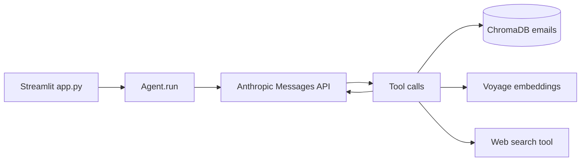

# Recruiting Agent

Streamlit chat app backed by **Claude** (Anthropic) with tools for querying indexed recruiting emails, researching companies on the web, scoring role fit, and drafting replies. Email bodies are chunked and embedded with **Voyage**, stored in a local **ChromaDB** vector database.

## Prerequisites

- Python 3.10+ recommended
- [Anthropic API key](https://docs.anthropic.com/claude/docs/getting-access-to-claude) (`ANTHROPIC_API_KEY`)
- [Voyage AI API key](https://docs.voyageai.com/) (`VOYAGE_API_KEY`) for embeddings and semantic search

Store secrets in environment variables or your team’s secrets workflow (for example [1Password `op run`](https://developer.1password.com/docs/cli/secrets-environment-variables/) with an `.env` file that stays out of git).

## Setup

From the repository root:

```bash
python -m venv .venv
source .venv/bin/activate   # Windows: .venv\Scripts\activate
pip install -r requirements.txt
```

Export API keys (example — prefer your own secret injection):

```bash
export ANTHROPIC_API_KEY="..."
export VOYAGE_API_KEY="..."
```

### Email source

Recruiting messages are loaded from `email_handler/emails.json` (JSON array of objects with `id`, `sender`, `sender_name`, `subject`, `date`, `read`, `body`). The indexer skips emails whose `id` is already represented in Chroma. Optional fields `_fit` and `_reason` are used by the fit evaluation script only.

On startup, `app.py` runs indexing so **new** emails in that file are embedded and written under `./chroma_db/` (ignored by git).

## Run the application

```bash
streamlit run app.py
```

Open the URL Streamlit prints (typically `http://localhost:8501`). Use the chat box to ask about emails; expand **Example queries** in the UI for starters.

### Optional runtime tuning

| Variable | Purpose |
| -------- | ------- |
| `TQDM_DISABLE` | Set to `1` / `true` to silence tqdm progress bars during indexing |
| `VOYAGE_EMBED_BATCH_SIZE` | Batch size for Voyage document embeddings (default `128`, max `256`) |
| `CHROMA_ADD_CHUNK_SLICE` | Rows per Chroma `add` when writing many chunks (default `16000`) |

## Agent architecture

- **Orchestrator**: `Agent` in `agent/agent.py` calls Claude (`claude-sonnet-4-20250514`) with a fixed system prompt and tool definitions, loops until `end_turn` or up to `max_iter` (default 20).
- **Streaming**: `run()` yields text tokens from `messages.stream`; `app.py` pipes that into `st.write_stream`.
- **Tool dispatch**: Claude’s `tool_use` blocks are executed in `dispatch_tool` and appended as `tool_result` user messages for the next model turn.



### Tools (`agent/tools.py` → `agent/tool_impl.py`)

| Tool | Role |
| ---- | ---- |
| `get_recruiting_emails` | Metadata filters (`days`, `sender`, `read`, `max_results`) over Chroma |
| `search_emails` | Semantic search: embed query with Voyage, query Chroma; dedupe by email id |
| `research_company` | Claude + built-in web search; returns structured JSON (funding, headcount, NYC, AI focus, etc.) |
| `evaluate_fit` | Requires prior `company_research`; scores role vs criteria in system prompt |
| `draft_response` | Generates interested / decline email body (does **not** send mail) |

Indexing pipeline: `EmailIndexer` (`email_handler/email_indexer.py`) chunks each body (sliding windows), embeds batches with Voyage, stores chunks with ids `{email_id}-{chunk_index}` and per-email metadata on every chunk.

## Fit evaluation

Benchmark how well `research_company` + `evaluate_fit` match labeled examples in `emails.json` (`_fit` gold labels):

```bash
python -m evals.fit_eval
```

Parallelism defaults to 8 workers; override with `EVAL_MAX_WORKERS`. Set `TQDM_DISABLE=1` for quieter logs.

## Repository layout

| Path | Role |
| ---- | ---- |
| `app.py` | Streamlit UI, system prompt, chat loop |
| `agent/agent.py` | Agent loop, Anthropic + Chroma + Voyage clients |
| `agent/tools.py` | Tool schemas passed to Claude |
| `agent/tool_impl.py` | Tool implementations |
| `email_handler/email_indexer.py` | Load JSON → chunk → embed → Chroma |
| `email_handler/emails.json` | Sample / local email corpus |
| `evals/` | Fit evaluation harness |

## Notes

- **No outbound email**: Drafts are for review only.
- **`chroma_db/`**: Local persistent store; regenerate by deleting the folder and re-running the app or indexer.
- **Model IDs**: Claude model is hardcoded in `agent/agent.py` and `tool_impl.py`; change there if you upgrade models.
